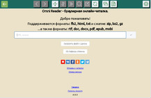

# Liberama

Браузерная онлайн-читалка книг.

Выглядит соледующим образом: [OmniReader](https://omnireader.ru)




При запуске приложения, по умолчанию веб-сервер доступен по адресу [http://127.0.0.1:44080](http://127.0.0.1:44080)

Для указания местоположения рабочей директории, воспользуйтесь [параметрами командной строки](#cli).
Дополнительные параметры сервера настраиваются в [конфигурационном файле](#config).

[Отблагодарить автора проекта](https://donatty.com/liberama)

## 
* [Возможности читалки](#capabilities)
* [Использование](#usage)
    * [Параметры командной строки](#cli)
    * [Конфигурация](#config)
    * [Разворачивание на VPS](#vps)
* [Сборка проекта](#build)
* [Разработка](#development)

<a id="capabilities" />

## Возможности читалки
- загрузка любой страницы интернета
- синхронизация данных (настроек и читаемых книг) между различными устройствами
- работа в автономном режиме (без связи)
- изменение цвета фона, текста, размер и тип шрифта и прочее
- установка и запоминание текущей позиции и настроек в браузере и на сервере
- кэширование файлов книг на клиенте и на сервере
- открытие книг с локального диска
- плавный скроллинг текста
- анимация перелистывания
- поиск по тексту и копирование фрагмента
- запоминание недавних книг, скачивание книги из читалки в формате fb2
- управление кликом и с клавиатуры
- регистрация не требуется
- поддерживаемые браузеры: Google Chrome, Mozilla Firefox последних версий
- релизы сервера под Linux, MacOS и Windows

<a id="usage" />

## Использование
Приложение представляет собой полноценный веб-сервер в виде единого исполнимого файла.
При первом запуске, будет создана рабочая директория `.liberama` (по умолчанию - в той же папке, где исполнимый файл),
в которой хранится конфигурационный файл `config.json`, файлы веб-приложения, файлы базы данных, журналы и прочее.
Изменить рабочую директорию можно с помощью cli-параметра --app-dir

По умолчанию веб-интерфейс будет доступен по адресу [http://127.0.0.1:44080](http://127.0.0.1:44080)

<a id="cli" />

### Параметры командной строки
Запустите `liberama --help`, чтобы увидеть список опций:
```console
Usage: liberama [options]

Options:
  --help              Показать опции командной строки
  --app-dir=<dirpath> Задать рабочую директорию, по умолчанию: <execDir>/.liberama
  --auto-repair       Починить БД приложения при запуске, если она повреждена
```

<a id="config" />

### Конфигурация
При первом запуске в рабочей директории будет создан конфигурационный файл `config.json`:
```js
{
    // Максимальный размер файла загружаемой книги (в байтах)
    "maxUploadFileSize": 52428800,

    // Максимальный размер каталога <appDir>/public-files/tmp для хранения конвертированных
    // файлов книг пользователей (в байтах)
    "maxTempPublicDirSize": 536870912,

    // Максимальный размер каталога <appDir>/public-files/upload для хранения
    // загруженных в /upload (кнопка "Загрузить файл с диска") файлов книг пользователей (в байтах)
    "maxUploadPublicDirSize": 209715200,

    // Использование внешних конвертеров (только в среде Linux)
    // Без них читалка может работать только с файлами формата fb2, txt, html, xml
    // Инструкции установки внешних конвертеров см. в docs/omnireader.ru/README.md
    "useExternalBookConverter": false,

    // Настройки для списка серверов.
    // Приложение может запускать одновременно несколько веб-серверов на разных портах
    "servers": [
        {
            // Произвольное название сервера
            "serverName": "1",

            // Режим работы сервера:
            //  "reader" - обычная читалка
            //  "omnireader" - модификации для сайта omnireader.ru
            //  "liberama.top" - модификации для сайта liberama.top
            //  "book_update_checker" - сервер обновлений
            "mode": "reader",

            // Хост, порт сервера
            "ip": "0.0.0.0",
            "port": "44080"
        }
    ],

    // Настройки удаленного хранилища
    "remoteStorage": false,

    // Для веб-приложения: включение/выключение работы с сервером обновлений
    "bucEnabled": false,

    // Подключение себя, как клиента, к серверу обновлений
    "bucServer": false
}
```

При необходимости, можно настроить нужный параметр в этом файле вручную.

<a id="vps" />

## VPS
Для разворачивания читалки на чистом VPS с нуля смотрите [docs/omnireader.ru](docs/omnireader.ru/README.md)

<a id="build" />

### Сборка проекта
Сборка только в среде Linux.
Необходима версия node.js не ниже 16.

Для сборки linux-arm64 необходимо предварительно установить [QEMU](https://wiki.debian.org/QemuUserEmulation).

```sh
git clone https://github.com/bookpauk/liberama
cd liberama
npm i
```

#### Релизы
```sh
npm run release
```

Результат сборки будет доступен в каталоге `dist/release`

<a id="development" />

### Разработка
```sh
npm run dev
```

Связаться с автором проекта: [bookpauk@gmail.com](mailto:bookpauk@gmail.com)
